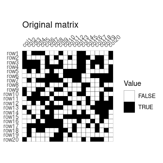
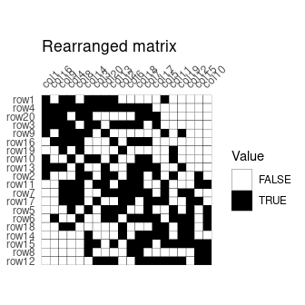
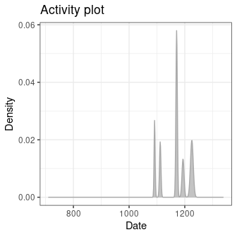
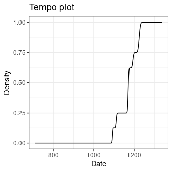

<!-- README.md is generated from README.Rmd. Please edit that file -->

# tabula 

<!-- badges: start -->

[](https://github.com/nfrerebeau/tabula/actions)
[](https://codecov.io/gh/nfrerebeau/tabula)

<!--[](https://cran.r-project.org/package=tabula)
[](https://cran.r-project.org/web/checks/check_results_tabula.html)
[](https://cran.r-project.org/package=tabula)-->

[](https://www.repostatus.org/#active)
[](https://www.tidyverse.org/lifecycle/#stable)

[](https://doi.org/10.5281/zenodo.1489944)
[](https://doi.org/10.21105/joss.01821)
<!-- badges: end -->

## Overview

An easy way to examine archaeological count data. This package provides
a convenient and reproducible toolkit for relative and absolute dating
and analysis of (chronological) patterns. It includes functions for
matrix seriation (reciprocal ranking, CA-based seriation), chronological
modeling and dating of archaeological assemblages and/or objects. Beyond
these, the package provides several tests and measures of diversity:
heterogeneity and evenness (Brillouin, Shannon, Simpson, etc.), richness
and rarefaction (Chao1, Chao2, ACE, ICE, etc.), turnover and similarity
(Brainerd-Robinson, etc.). The package make it easy to visualize count
data and statistical thresholds: rank vs. abundance plots, heatmaps,
Ford (1962) and Bertin (1977) diagrams.

To cite **tabula** in publications please use:

> Frerebeau, N. (2019). tabula: An R Package for Analysis, Seriation,
> and Visualization of Archaeological Count Data. *Journal of Open
> Source Software*, 4(44), 1821. DOI
> [10.21105/joss.01821](https://doi.org/10.21105/joss.01821).

## Installation

You can install the released version of **tabula** from
[CRAN](https://CRAN.R-project.org) with:

``` r
install.packages("tabula")
```

Or install the development version from GitHub with:

``` r
# install.packages("remotes")
remotes::install_github("nfrerebeau/tabula")
```

## Usage

``` r
# Load packages
library(tabula)
#> Loading required package: arkhe

library(khroma)
library(ggplot2)
library(magrittr)
```

**tabula** uses a set of S4 classes that represent different special
types of matrix. Please refer to the documentation of the
[**arkhe**](https://github.com/nfrerebeau/arkhe) package where these
classes are defined.

*It assumes that you keep your data tidy*: each variable (type/taxa)
must be saved in its own column and each observation (sample/case) must
be saved in its own row.

### Visualization

Several types of graphs are available in **tabula** which uses
[**ggplot2**](https://github.com/tidyverse/ggplot2) for plotting
informations. This makes it easy to customize diagrams (e.g. using
themes and scales).

Spot matrix\[1\] allows direct examination of data:

``` r
# Plot co-occurrence of types
# (i.e. how many times (percent) each pairs of taxa occur together 
# in at least one sample.)
mississippi %>%
  as_occurrence() %>%
  plot_spot() +
  ggplot2::labs(size = "", colour = "Co-occurrence") +
  ggplot2::theme(legend.box = "horizontal") +
  khroma::scale_colour_YlOrBr()
```


Bertin or Ford (battleship curve) diagrams can be plotted, with
statistic threshold (including B. Desachy’s
[sériographe](https://doi.org/10.3406/pica.2004.2396)).

``` r
# Bertin matrix with variables scaled to 0-1 and the variable mean as threshold
scale_01 <- function(x) (x - min(x)) / (max(x) - min(x))
mississippi %>%
  as_count() %>%
  plot_bertin(threshold = mean, scale = scale_01) +
  khroma::scale_fill_vibrant()
```


``` r
compiegne %>%
  as_count() %>%
  plot_ford()
#> 0 dates were set.
```


### Seriation

``` r
# Build an incidence matrix with random data
set.seed(12345)
incidence <- IncidenceMatrix(data = sample(0:1, 400, TRUE, c(0.6, 0.4)),
                             nrow = 20)

# Get seriation order on rows and columns
# Correspondance analysis-based seriation
(indices <- seriate_rank(incidence, margin = c(1, 2)))
#> <PermutationOrder>
#> Permutation order for matrix seriation:
#> - Row order: 1 4 20 3 9 16 19 10 13 2 11 7 17 5 6 18 14 15 8 12...
#> - Column order: 1 16 9 4 8 14 3 20 13 2 6 18 7 17 5 11 19 12 15 10...
#> - Method: reciprocal ranking

# Permute matrix rows and columns
incidence2 <- permute(incidence, indices)
```

``` r
# Plot matrix
plot_heatmap(incidence) + 
  ggplot2::labs(title = "Original matrix") +
  ggplot2::scale_fill_manual(values = c("TRUE" = "black", "FALSE" = "white"))
plot_heatmap(incidence2) + 
  ggplot2::labs(title = "Rearranged matrix") +
  ggplot2::scale_fill_manual(values = c("TRUE" = "black", "FALSE" = "white"))
```



### Dating

This package provides an implementation of the chronological modeling
method developed by Bellanger and Husi
([2012](https://doi.org/10.1016/j.jas.2011.06.031)). This method is
slightly modified here and allows the construction of different
probability density curves of archaeological assemblage dates (*event*,
*activity* and *tempo*). Note that this implementation is experimental
(see `help(date_event)`).

``` r
# Coerce dataset to abundance (count) matrix
zuni_counts <- as_count(zuni)
# Assume that some assemblages are reliably dated (this is NOT a real example)
# The names of the vector entries must match the names of the assemblages
zuni_dates <- c(
  LZ0569 = 1097, LZ0279 = 1119, CS16 = 1328, LZ0066 = 1111,
  LZ0852 = 1216, LZ1209 = 1251, CS144 = 1262, LZ0563 = 1206,
  LZ0329 = 1076, LZ0005Q = 859, LZ0322 = 1109, LZ0067 = 863,
  LZ0578 = 1180, LZ0227 = 1104, LZ0610 = 1074
)

# Model the event date for each assemblage
model <- date_event(zuni_counts, dates = zuni_dates, cutoff = 90)
# Predict event and accumulation dates
event <- predict_event(model, zuni_counts)

# Plot activity and tempo distributions
plot_date(event, type = "activity", select = "LZ1105") +
  ggplot2::labs(title = "Activity plot") +
  ggplot2::theme_bw()
plot_date(event, type = "tempo", select = "LZ1105") +
  ggplot2::labs(title = "Tempo plot") +
  ggplot2::theme_bw()
```



### Analysis

*Diversity* can be measured according to several indices (referred to as
indices of *heterogeneity* – see `vignette("diversity")`):

``` r
mississippi %>%
  as_count() %>%
  index_heterogeneity(method = "shannon")
#> <HeterogeneityIndex: shannon>
#>             size     index
#> 10-P-1       153 1.2027955
#> 11-N-9       758 0.7646565
#> 11-N-1      1303 0.9293974
#> 11-O-10      638 0.8228576
#> 11-N-4      1266 0.7901428
#> 13-N-5        79 0.9998430
#> 13-N-4       241 1.2051989
#> 13-N-16      171 1.1776226
#> 13-O-11      128 1.1533432
#> 13-O-10      226 1.2884172
#> 13-P-1       360 1.1725355
#> 13-P-8       192 1.5296294
#> 13-P-10       91 1.7952443
#> 13-O-7      1233 1.1627477
#> 13-O-5      1709 1.0718463
#> 13-N-21      614 0.9205717
#> 12-O-5       424 1.1751002
#> Holden Lake  360 0.7307620
#> 13-N-15     1300 1.1270126
#> 12-N-3       983 1.0270291

## Test difference in Shannon diversity between assemblages
## (returns a matrix of adjusted p values)
mississippi[1:5, ] %>%
  as_count() %>%
  test_diversity()
#>               10-P-1       11-N-9       11-N-1   11-O-10
#> 11-N-9  0.000000e+00           NA           NA        NA
#> 11-N-1  3.609626e-08 8.538298e-05           NA        NA
#> 11-O-10 2.415845e-13 4.735511e-01 2.860461e-02        NA
#> 11-N-4  0.000000e+00 7.116363e-01 7.961107e-05 0.7116363
```

Corresponding *evenness* (i.e. a measure of how evenly individuals are
distributed across the sample) can also be computed, as well as
*richness* and *rarefaction*.

``` r
# Data from Conkey 1980, Kintigh 1989, p. 28
altamira %>%
  as_count() %>%
  index_richness(method = "none", simulate = TRUE) %>% 
  plot_diversity()
```


Several methods can be used to ascertain the degree of *turnover* in
taxa composition along a gradient on qualitative (presence/absence)
data. It assumes that the order of the matrix rows (from *1* to *n*)
follows the progression along the gradient/transect.

Diversity can also be measured by addressing *similarity* between pairs
of sites:

``` r
## Calculate the Brainerd-Robinson index
## Plot the similarity matrix
mississippi %>%
  as_count() %>%
  similarity(method = "brainerd") %>%
  plot_spot() +
  ggplot2::labs(size = "Similarity", colour = "Similarity") +
  khroma::scale_colour_iridescent()
```


## Contributing

Please note that the **tabula** project is released with a [Contributor
Code of
Conduct](https://github.com/nfrerebeau/tabula/blob/master/.github/CODE_OF_CONDUCT.md).
By contributing to this project, you agree to abide by its terms.

1.  Adapted from Dan Gopstein’s original
    [idea](https://dgopstein.github.io/articles/spot-matrix/).
